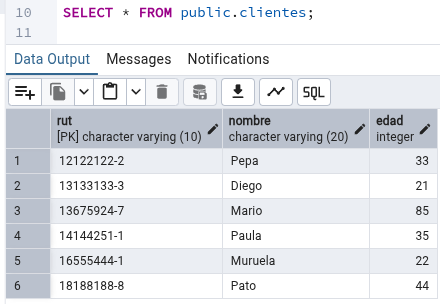
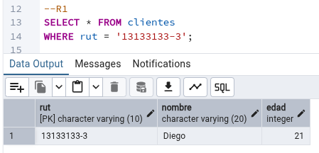
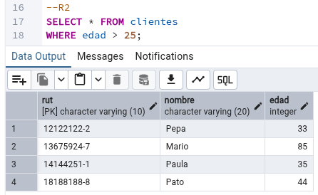
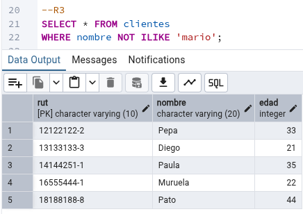
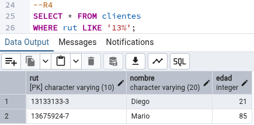
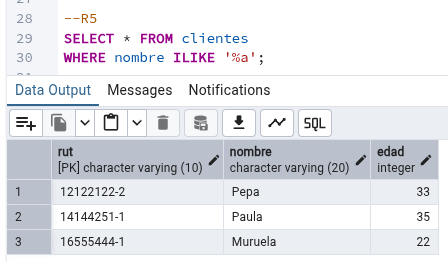
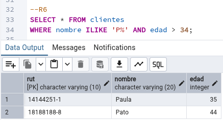
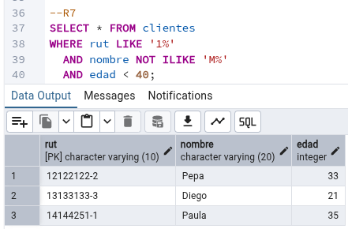
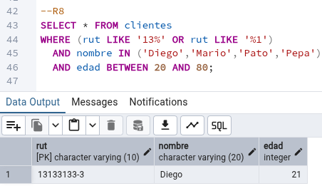

# Ejercicio Sql

## 1. SQL

Consodere la siguiente tabla:



```sql
CREATE TABLE public.clientes
(
    rut character varying(10) NOT NULL,
    nombre character varying(20),
    edad integer,
    PRIMARY KEY (rut)
);

ALTER TABLE IF EXISTS public.clientes
    OWNER to postgres;

```

---

## Crear una consulta SQL para cada uno de los siguientes requerimientos:

---

- Todos los clientes con rut 13133133-3

```sql
--R1
SELECT * FROM clientes
WHERE rut = '13133133-3';
```

## 

- Todos los clientes mayores de 25 años

```sql
--R2
SELECT * FROM clientes
WHERE edad > 25;
```



---

- Todos los clientes que no se llamen Mario

```sql
--R3
SELECT * FROM clientes
WHERE nombre NOT ILIKE 'mario';
```

## 

- Todos los clientes con rut empezado en 13

```sql

--R4
SELECT * FROM clientes
WHERE rut LIKE '13%';
```



---

- Todos los clientes con nombre finalizado en a

```sql
--R5
SELECT * FROM clientes
WHERE nombre ILIKE '%a';
```

## 

- Todos los clientes nombre empezado en P y edad mayor a 34

```sql
--R6
SELECT * FROM clientes
WHERE nombre ILIKE 'P%' AND edad > 34;
```

## 

- Todos los clientes con rut empezado en 1, nombre no empezado en M y edad menor a 40

```sql
--R7
SELECT * FROM clientes
WHERE rut LIKE '1%'
  AND nombre NOT ILIKE 'M%'
  AND edad < 40;
```

## 

- Todos los clientes con rut empezado en 13 o terminado en 1, con nombres Diego, Mario, Pato, Pepa y edad entre 20 y 80

```sql
--R8
SELECT * FROM clientes
WHERE (rut LIKE '13%' OR rut LIKE '%1')
  AND nombre IN ('Diego','Mario','Pato','Pepa')
  AND edad BETWEEN 20 AND 80;
```

## 
