```sql
DROP TABLE IF EXISTS finanzas_personales;

CREATE TABLE finanzas_personales
(
    nombre character varying(20) COLLATE pg_catalog."default" NOT NULL,
    me_debe integer,
    cuotas_cobrar integer,
    le_debo integer,
    cuotas_pagar integer,
    CONSTRAINT finanzas_personales_pkey PRIMARY KEY (nombre)
);

insert into finanzas_personales (nombre, me_debe, cuotas_cobrar, le_debo, cuotas_pagar)
values ('tía carmen', 0, 0, 5000, 1);
insert into finanzas_personales (nombre, me_debe, cuotas_cobrar, le_debo, cuotas_pagar)
values ('papá', 0, 0, 15000, 3);
insert into finanzas_personales (nombre, me_debe, cuotas_cobrar, le_debo, cuotas_pagar)
values ('nacho', 10000, 2, 7000, 1);
insert into finanzas_personales (nombre, me_debe, cuotas_cobrar, le_debo, cuotas_pagar)
values ('almacén esquina', 0, 0, 13000, 2);
insert into finanzas_personales (nombre, me_debe, cuotas_cobrar, le_debo, cuotas_pagar)
values ('vicios varios', 0, 0, 35000, 35);
insert into finanzas_personales (nombre, me_debe, cuotas_cobrar, le_debo, cuotas_pagar)
values ('compañero trabajo', 50000, 5, 0, 0);

select * from finanzas_personales ;

```

--1. A quién(es) le debe más dinero y cuánto
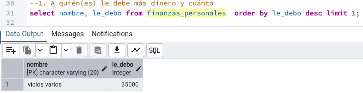

```sql
select nombre, le_debo 
from finanzas_personales  
order by le_debo desc 
limit 1;
```
---
2. Quién(es) le debe más dinero a ud. y cuánto
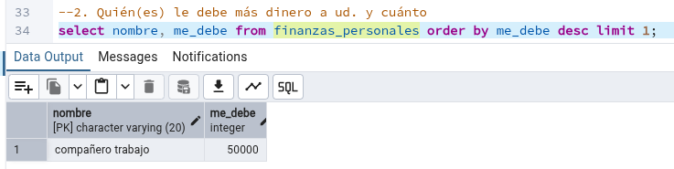
```sql
select nombre, me_debe 
from finanzas_personales 
order by me_debe desc 
limit 1;
```
---
3. Cuánto dinero debe en total
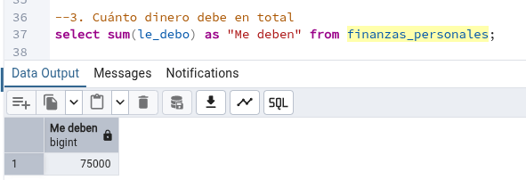
```sql
select sum(le_debo) as "deuda" 
from finanzas_personales;
```
---
4. Cuánto dinero debe en promedio.

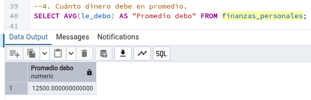

```sql
SELECT AVG(le_debo) AS "Promedio deuda" 
FROM finanzas_personales;
```
---
5. Suponiendo que no puede pagar más de una cuota al mes. ¿Cuántos
meses demoraría en saldar su deuda?

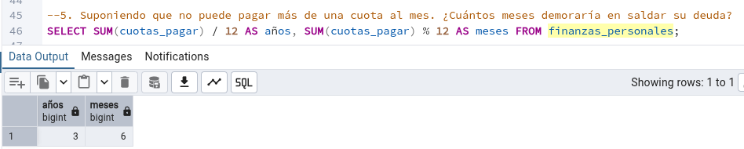
```sql
SELECT SUM(cuotas_pagar) / 12 AS años, SUM(cuotas_pagar) % 12 AS meses 
FROM finanzas_personales;
```
---


6. Suponga  que logar cobrar  todo lo  que le  deben  en  un mismo día y
decide usar todo eso para pagar lo que se pueda de su deuda.

 * ¿A cuánto ascendería su nueva deuda reducida?
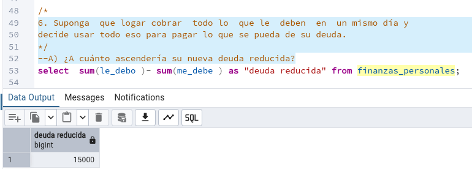

```sql
select  sum(le_debo )- sum(me_debe ) as "deuda reducida" from finanzas_personales;
```
 * ¿Cuánto tendría que pagar mensualmente para pagar todo lo que resta en las cuotas ya acordadas? 
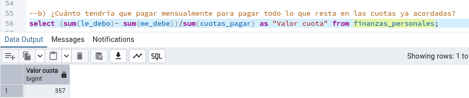
```sql
select (sum(le_debo)- sum(me_debe))/sum(cuotas_pagar) as "Valor cuota" from finanzas_personales;
```
---
    Repentinamente recibes una llamada telefónica. Es tu pareja, y parece que tiene un problema. Te explica de varias formas una misma situación como intentando que reacciones de alguna forma, como si supieras algo que no quieres decir, cuando de pronto lo recuerdas: LE DEBES 50 LUCAS Y NO TE ACORDABAS. 

7. Insertar un nuevo registro en la tabla.
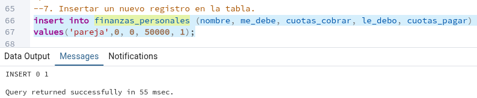
```sql
insert into finanzas_personales (nombre, me_debe, cuotas_cobrar, le_debo, cuotas_pagar) 
values('pareja',0, 0, 50000, 1);
```
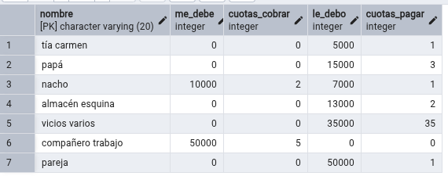
---
8. Con este cambio empezó a temblar realmente tu situación económica y lo primero que quisiera averiguar es ¿De cuánto será la cuota a pagar este mes? 
   
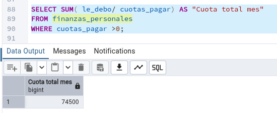
```sql
SELECT SUM( le_debo/ cuotas_pagar) AS "Cuota total mes" 
FROM finanzas_personales 
WHERE cuotas_pagar >0;

```
---


    No tuviste la valentía para negociar las cuotas con tu pareja, pero la señora del almacén de la esquina te tiene buena y te permitió bondadosamente pagarle en 13 cuotas. 
9. Realizar el update en la tabla.
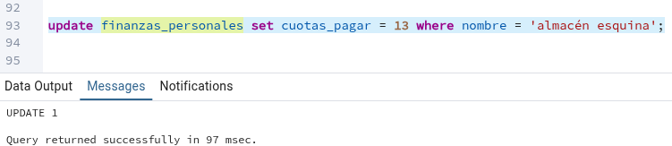

```sql
update finanzas_personales 
set cuotas_pagar = 13 
where nombre = 'almacén esquina';
```
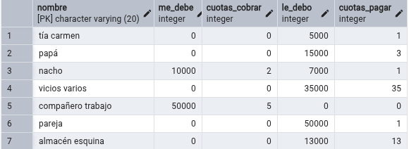

---
10. Ahora  que  realizaste  este  pequeño  (pero importante)  ajuste  ¿De cuánto será la cuota a pagar este mes?
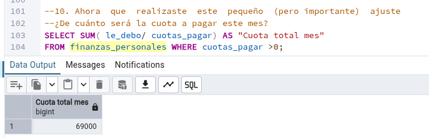
```sql
SELECT SUM( le_debo/ cuotas_pagar) AS "Cuota total mes" 
FROM finanzas_personales 
WHERE cuotas_pagar >0;
```